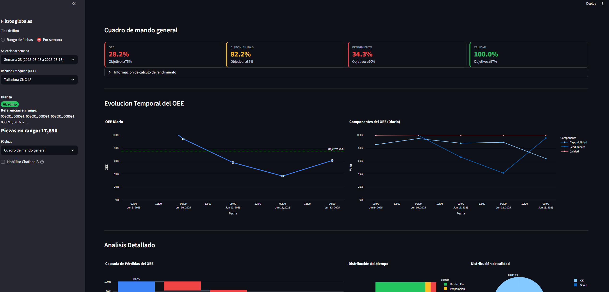

# 📊 Sistema de Monitorización de Planta Industrial

Dashboard con Machine Learning e IA para análisis de OEE, predicción de scrap y monitorización en tiempo real.

---

## 📸 Vista General



---

## 🚀 Inicio Rápido

### Instalación

```bash
# Clonar repositorio
git clone https://github.com/tu-usuario/proyecto_adi.git
cd proyecto_adi

# Instalar dependencias
pip install -r requirements.txt

# Arrancar dashboard
streamlit run app.py
```

El dashboard se abre automáticamente en `http://localhost:8501`

---

## ✨ Qué Incluye

### Dashboard Interactivo
- **OEE en tiempo real**: Disponibilidad, Rendimiento, Calidad
- **Análisis de producción**: Scrap, UPH, seguimiento de órdenes
- **Gestión RRHH**: Absentismo, productividad, saturación
- **Control de almacén**: Entradas MP y PT

### Modelos ML Pre-entrenados
- **Clustering**: Agrupa máquinas similares (K-Means)
- **Predicción Scrap**: Anticipa problemas de calidad (Random Forest)
- **Clasificación Estado**: Identifica máquinas críticas (Random Forest)

Los modelos se cargan automáticamente con pickle, listos para usar.

### Asistente IA (Opcional)
- Chatbot flotante con LLM local (Ollama + Llama 3)
- Explica métricas y responde preguntas
- Todo en local, privacidad garantizada

---

## 💬 Configurar Chatbot IA (Opcional)

El dashboard funciona sin el chatbot, pero si lo quieres:

```bash
# Instalar Ollama
curl -fsSL https://ollama.ai/install.sh | sh

# Iniciar servidor y descargar modelo
ollama serve
ollama pull llama3
```

Habilita el chatbot desde la barra lateral del dashboard.

Más info: [CHATBOT_README.md](CHATBOT_README.md)

---

## 📂 Estructura

```
proyecto_adi/
├── app.py                 # Archivo principal
├── data/                  # Datos de producción
├── models/                # Modelos ML pre-entrenados
│   ├── clustering/
│   ├── regression/
│   └── classification/
└── scripts/dashboard/     # Código del dashboard
    └── pages/            # Páginas del menú
```

---

## 📖 Menús del Dashboard

El dashboard tiene 8 páginas. Cada una con filtros de fecha, máquina, cliente, etc.

| Menú | Qué Hace |
|------|----------|
| **Cuadro de Mando General** | OEE, análisis de pérdidas, Pareto de incidencias, heatmaps |
| **Producción** | Volumen, scrap por máquina/referencia, seguimiento de órdenes |
| **Almacén MP** | Recepciones de materia prima y producto terminado |
| **RRHH** | Horas disponibles, absentismo, productividad laboral |
| **Clustering ML** | Agrupa máquinas interactivamente (entrena en vivo) |
| **ML - Clustering** | Usa modelo pre-entrenado para asignar clusters |
| **ML - Regresión Scrap** | Predice tasa de scrap esperada |
| **ML - Clasificación Estado** | Clasifica máquinas en 4 estados (Excelente/Buena/Requiere Atención/Crítica) |

**Guía detallada de cada menú**: [DASHBOARD_GUIDE.md](DASHBOARD_GUIDE.md)

---

## 🧠 Modelos de Machine Learning

Los 3 modelos están **pre-entrenados** y se cargan automáticamente al abrir las páginas correspondientes.

### Carga Automática con Pickle

```python
@st.cache_resource
def load_model():
    with open("models/regression/trained_model/random_forest_model.pkl", "rb") as f:
        return pickle.load(f)
```

### Re-entrenar (si quieres actualizar con nuevos datos)

```bash
python models/clustering/train.py
python models/regression/train.py
python models/classification/train.py
```

Más detalles: [models/README.md](models/README.md)

---

## 🎯 Para Qué Sirve

**Operadores**: Monitorizar OEE, detectar problemas en máquinas
**Managers**: Ver tendencias de productividad, comparar turnos
**Mantenimiento**: Identificar máquinas que requieren atención
**Calidad**: Predecir scrap, detectar causas raíz

---

## 🔧 Opciones de Arranque

```bash
# Puerto personalizado
streamlit run app.py --server.port 8080

# Sin abrir navegador
streamlit run app.py --server.headless true

# Con recarga automática
streamlit run app.py --server.runOnSave true
```

---

## 🆘 Problemas Comunes

**Dashboard no carga:**
- Verifica que existe `data/processed/`
- Revisa logs en consola

**Modelos ML no funcionan:**
- Asegúrate que existen `models/*/trained_model/*.pkl`

**Chatbot no responde:**
- Verifica Ollama: `curl http://localhost:11434`
- Comprueba modelo: `ollama list`

---

## 📚 Más Documentación

- **[Guía del Dashboard](DASHBOARD_GUIDE.md)** - Qué hace cada menú, cómo interpretar gráficos
- **[Modelos ML](models/README.md)** - Features, algoritmos, métricas
- **[Chatbot IA](CHATBOT_README.md)** - Configuración avanzada

---

## 📞 Info del Proyecto

**Universidad de Deusto** | Análisis de Datos en la Industria | 2024-2025

---

**¡Listo para analizar tu planta!** 🚀
